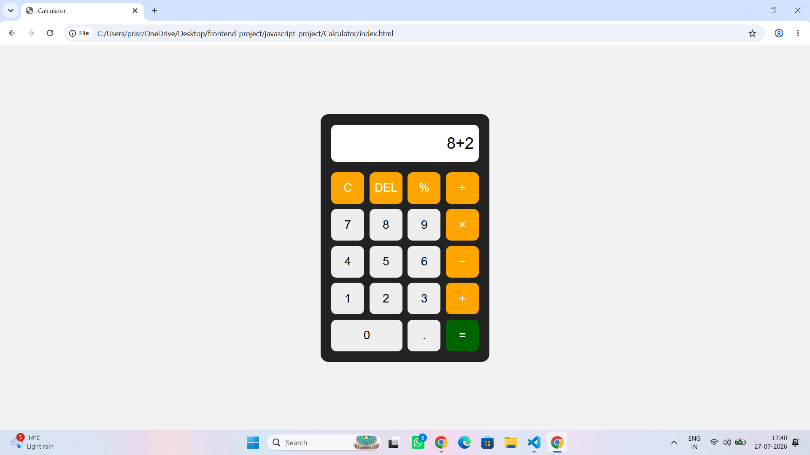

#  Calculator

A simple calculator built using **HTML, CSS, and JavaScript**. It performs basic arithmetic operations with a clean  user interface.

## Screenshot

## Features

- Basic arithmetic operations
- Clear (C) button
- Delete (DEL) button

## Technologies Used

- HTML
- CSS
- JavaScript