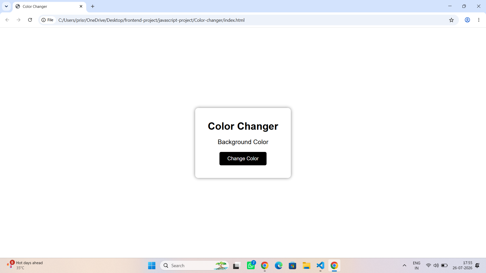
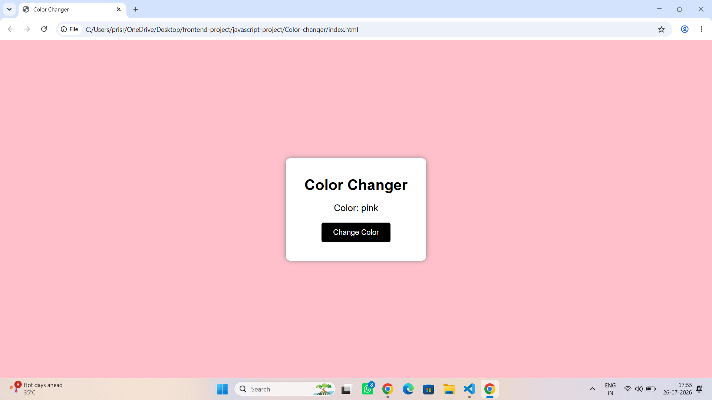
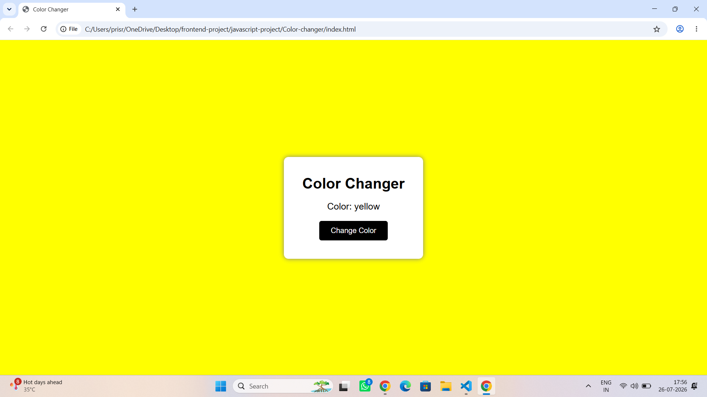

# Color Changer

A simple Color Changer project built using **HTML, CSS, and JavaScript..

## 📸 Screenshot

## Features
- Changes background color randomly
- Displays the selected color name
- Simple and beginner-friendly

## Technologies
- HTML
- CSS
- JavaScript

## Concepts Used
- DOM Manipulation
- Arrays
- Functions
- Events
- Math.random()
- addEventListener()

## Author
Srishti Priya