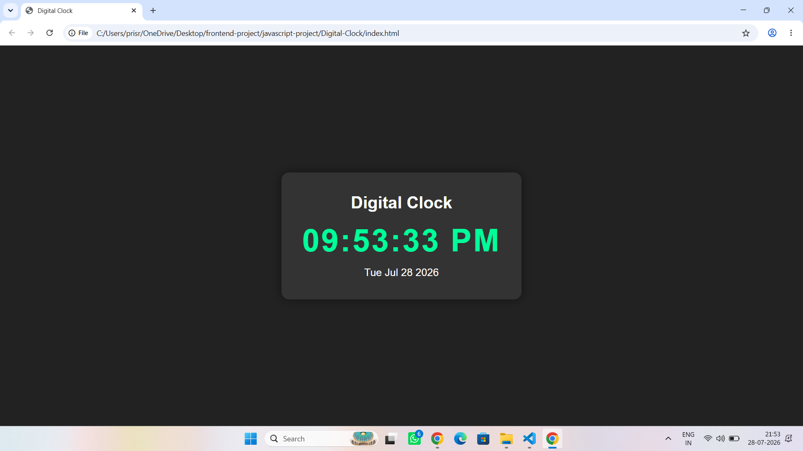

# Digital Clock

A simple digital clock built using **HTML, CSS, and JavaScript**. It displays the current time with a clean and simple user interface.

## Screenshot

## Features

- Displays current time
- Updates time automatically
- Simple and clean design

## Technologies Used

- HTML
- CSS
- JavaScript